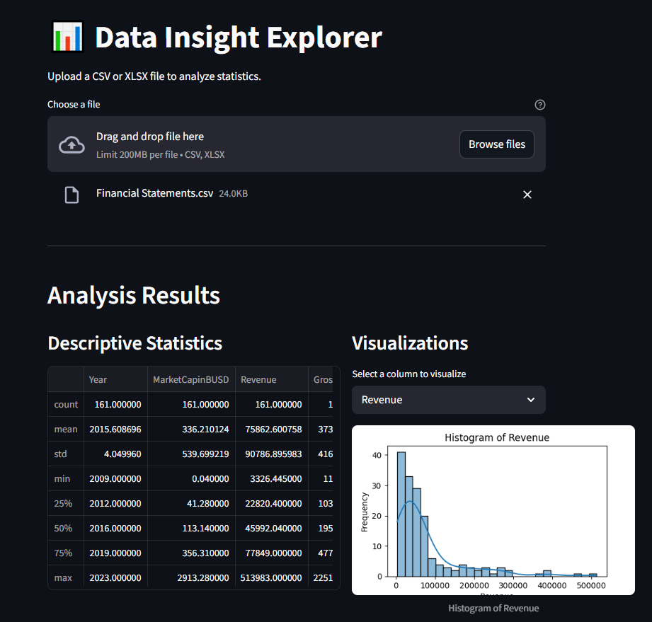

# Data-Insight-Explorer

A lightweight, containerized web app for uploading CSV files, cleaning the data, generating summary statistics, and visualizing quick insights — all powered by **FastAPI** and **Streamlit**.

>>>>>>> 167aa403abebd97f34900783d6577b6872b281b6
---

##  Features

- Upload CSV files via a web interface
- Clean and preprocess data automatically
- Generate basic statistics (mean, median, missing values, etc.)
- Visualize column distributions using histograms
- Powered by:
  - ⚡ FastAPI (for backend processing)
  - 🌐 Streamlit (for frontend interaction)
  - 🐳 Docker (for simple deployment)

---

## Tech Stack

- **FastAPI** – high-performance API framework
- **Streamlit** – for simple, interactive dashboards
- **Pandas** – data processing
- **Docker** – containerization
- **Docker Compose** – multi-service orchestration

---

## 📂 Project Structure

project-root/
│
├── api/ # FastAPI backend
│ ├── main.py
│ ├── clean_data.py
│ ├── statistics.py
│ ├── visualization.py
│ ├── requirements.txt
│ └── Dockerfile
│
├── webapp/ # Streamlit frontend
│ ├── app.py
│ ├── requirements.txt
│ └── Dockerfile
│
├── docker-compose.yml
└── README.md